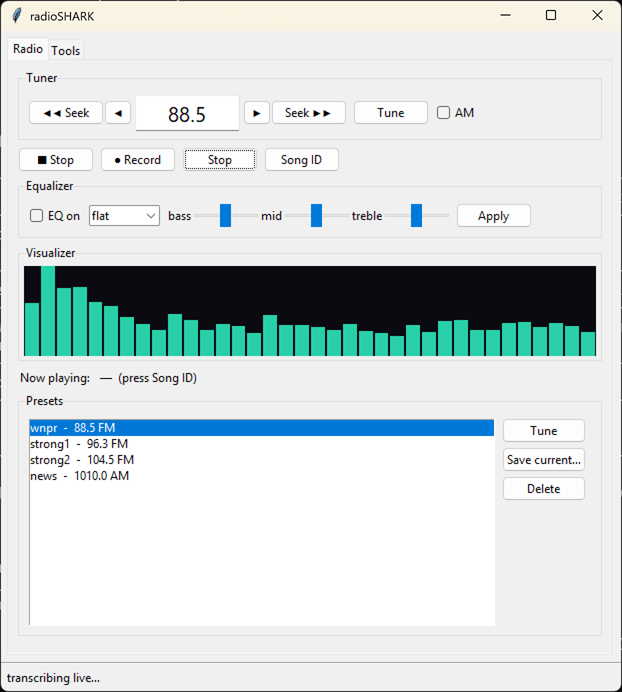
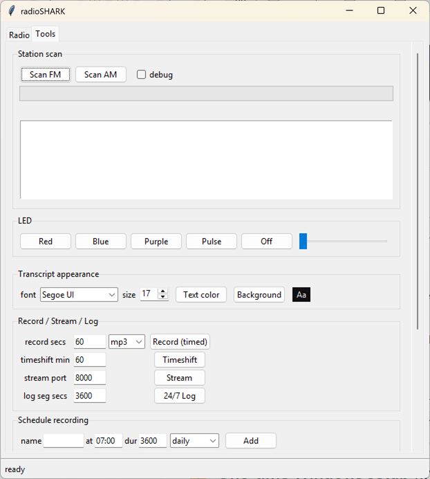

# 🦈 radioSHARK

**Bring the 2004 Griffin radioSHARK back to life — and give it superpowers it never had.**

The radioSHARK is a shark-fin-shaped USB AM/FM radio from 2004. It was a neat
idea — "TiVo for radio" — but its software is long-dead XP/PowerPC-era abandonware
that won't run on anything modern. This project revives the hardware on **Windows 11**
(and is built to port to **Linux**), then blows past what the original could do:
live listening, recording, scheduled recording, timeshift, network streaming,
24/7 logging, a station scanner, **song identification**, and **live transcription**.

It's an obscure little gadget now, but they still turn up on eBay for around
**$20** — genuinely worth it if you're into this kind of thing. For the period
flavor, here's the [2005 Ars Technica review](https://arstechnica.com/gadgets/2005/01/radioshark/)
that this project set out to match (and then some).

| Radio | Tools |
|---|---|
|  |  |

<p align="center"></p>

---

## Features

* 📻 **Tune AM/FM** with a car-radio **Seek** that stops on the next station
* 🔊 **Listen** live, with a toggleable **equalizer** (presets + custom sliders)
* 📊 A live **spectrum visualizer**
* ⏺️ **Record** to MP3/WAV/AAC — *while you keep listening*
* ⏯️ **Timeshift** — pause and rewind live radio (TiVo-style circular buffer)
* 🌐 **Stream** your radio to your phone/VLC over the network
* 🗓️ **Schedule** recordings and **wake-to-radio alarms**
* 🛰️ **24/7 logging** into timestamped segments
* 🔎 **Scan** the whole band and rank the stations it finds
* 🎵 **Song ID** what's playing (via Shazam)
* 📝 **Live transcription** in a karaoke-style window (local Whisper) — great for
  talk radio
* 💡 Full **LED** control (blue / red / purple / pulse)

Two front-ends share one engine, so they're always feature-identical:

* a **CLI** (`shark.py`) — Windows terminal and Linux terminal
* a **GUI** (`shark_gui.py`) — Tkinter, runs unchanged on Windows and Linux

---

## Quick start

```bash
# 1. install deps (ffmpeg must also be on PATH: winget install Gyan.FFmpeg)
pip install -r requirements.txt

# 2. enable the shark + free its HID interface (see notes below)
powershell -ExecutionPolicy Bypass -File scripts\setup-windows.ps1   # Windows
./scripts/setup-linux.sh                                             # Linux

# 3. cache the transcription model (one-time, optional)
python shark.py prepare

# 4. go
python shark_gui.py        # the GUI   (or: python shark.py gui)
python shark.py 88.5       # ...or drive it from the command line
```

### ⚠️ Windows: enable the audio device (one-time)

Windows ships the shark's USB-audio capture endpoint **disabled**, so at first the
device looks dead even though it's fine. **Run the setup script** and it's handled:

```powershell
powershell -ExecutionPolicy Bypass -File scripts\setup-windows.ps1
```

It finds the endpoint by its hardware ID, enables it, and restarts the audio
service (it'll prompt for admin). Prefer to do it by hand? Open `mmsys.cpl` →
**Recording** → right-click → show disabled/disconnected devices → enable
**Analog Connector (RadioSHARK)**.

### 🐧 Linux: free the HID interface (one-time)

Audio works out of the box (ALSA, auto-detected). Tuning needs the kernel
`radio-shark` driver to let go of the HID interface so this app can drive it from
userspace — `scripts/setup-linux.sh` blacklists that driver, adds a udev rule for
non-root access, and finds the ALSA card. Unplug/replug afterward, then run
`python shark.py doctor` to confirm everything's wired up. See
[docs/HARDWARE.md](docs/HARDWARE.md#running-on-linux) for the details and the
V4L2 alternative.

### Requirements

* **Python 3.10+** and **ffmpeg/ffplay** on `PATH`
* `pip install -r requirements.txt` — `hidapi` (tuning/LEDs), `shazamio`
  (+`audioop-lts` on Python 3.13+) for song ID, `faster-whisper` for transcription

---

## CLI reference

```
python shark.py <freq>                 tune (shorthand);  e.g. 88.5
python shark.py tune <freq> [--am] [--japan]
python shark.py listen [--eq P] [--seconds N] [--freq F] [--am]
python shark.py rec <secs> [--freq F] [--am] [--format mp3|wav|aac] [--eq P] [--out F]
python shark.py scan [--am] [--debug]
python shark.py seek [--down] [--am] [--from F]
python shark.py timeshift [--freq F] [--am] [--buffer-min N]
python shark.py stream [--freq F] [--port N] [--format mp3|aac] [--icecast URL]
python shark.py log [--freq F] [--segment SECS] [--format mp3|aac|wav] [--dir D]
python shark.py songid [--seconds N]
python shark.py transcribe [--live] [--seconds N] [--model base] [--file F]
python shark.py prepare                cache the Whisper model
python shark.py doctor                  check deps, ffmpeg, HID + audio device
python shark.py preset add <name> <freq> [--am] [--label "..."]   |   presets
python shark.py schedule add <name> (--freq F | --preset P) --at HH:MM [--dur S] [--repeat ...]
python shark.py schedule list | remove <name>      (also: alarm add|list|remove)
python shark.py led [--red on|off] [--blue 0-127] [--pulse 0-127]
python shark.py gui
```

EQ profiles: `flat`, `bass`, `treble`, `voice`, `music`, `warm`.

---

## Under the hood

Curious how a 2004 USB radio actually works, the HID tuning protocol, the
single-capture fan-out engine, and how it ports to Linux? See
**[docs/HARDWARE.md](docs/HARDWARE.md)**. Minimal protocol demos are in
[`examples/`](examples/).

> Not a true SDR — the TEA5757 chip only demodulates broadcast AM/FM to audio.
> For wideband SDR (aircraft, weather sats, etc.), grab an RTL-SDR.

HID/tuning protocol derived from the Linux kernel `radio-shark.c` / `tea575x.c`
by Hans de Goede. Built with ffmpeg, hidapi, shazamio, and faster-whisper.

## License

MIT — see [LICENSE](LICENSE).
