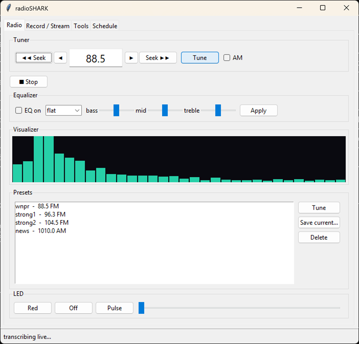
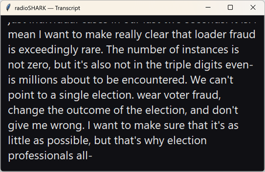

# radioSHARK

Modern software for the **Griffin radioSHARK** (USB `077d:627a`) — the shark-fin
USB AM/FM radio from 2004. The original Griffin app is long-dead XP/PPC-era
software; this project revives the hardware on **Windows 11** (and is built to
port to **Linux**), then goes well past what the original could do: live listen,
recording, scheduled recording, timeshift, network streaming, 24/7 logging,
a station scanner, **song identification**, and **live transcription**.

It ships in two front-ends that share one engine:

* a **CLI** (`shark.py`) — works in a Windows terminal and a Linux terminal
* a **GUI** (`shark_gui.py`) — Tkinter, runs unchanged on Windows and Linux





---

## How the hardware works

The radioSHARK is **two USB devices in one**:

1. A **USB HID** interface — receives tuning commands and drives the LEDs.
2. A **USB Audio** capture interface — the demodulated AM/FM audio arrives at the
   PC as a *recording* input (no separate driver needed).

So everything is: **tune over HID → capture/handle the audio from the USB input.**
The 3.5 mm jack on the unit is a **combination headphone-out / antenna** — you
never feed audio *into* it; a wire or earbuds plugged in act as an FM antenna and
noticeably improve weak stations.

**LEDs:** the fins glow **blue** when powered and **red** when recording. There's
no dedicated purple LED, but red+blue can be driven together for a purple glow
(the "Purple" button) — which is why the idle blue looks "blue-purple" through the
translucent housing.

The HID tuning protocol (FM PLL, AM, LED registers) was reconstructed from the
Linux kernel drivers `drivers/media/radio/radio-shark.c` and `tea575x.c` by
Hans de Goede.

---

## ⚠️ One-time Windows setup (important)

Windows ships the shark's audio endpoint **disabled**, so at first it looks dead.
Enable it once:

1. Right-click the speaker icon → **Sound settings** → **More sound settings**
   (or run `mmsys.cpl`) → **Recording** tab.
2. Right-click in the list → enable **Show Disabled Devices** and
   **Show Disconnected Devices**.
3. Find **Analog Connector (RadioSHARK)**, right-click → **Enable**.

If it shows a level but you capture silence, also make sure its level isn't muted
(Recording → its Properties → Levels).

---

## Requirements

* **Python 3.10+**
* **ffmpeg / ffplay** on `PATH` (e.g. `winget install Gyan.FFmpeg`)
* Python packages: `pip install -r requirements.txt`
  * `hidapi` — tuning + LEDs (required)
  * `shazamio` + `audioop-lts` — song ID (`audioop-lts` is required on Python 3.13+,
    which removed the stdlib `audioop` that shazamio needs)
  * `faster-whisper` — live transcription (downloads a model on first use; run
    `python shark.py prepare` once to cache it)
* Optional (Windows): `AudioDeviceCmdlets` PowerShell module if you need to script
  the capture level.

---

## Quick start

```bash
python shark.py prepare        # one-time: cache the transcription model
python shark_gui.py            # launch the GUI   (or: python shark.py gui)

# ...or drive it from the command line:
python shark.py 88.5           # tune FM
python shark.py listen         # play through the speakers
python shark.py scan           # find stations
```

---

## The GUI

**Radio tab** — everyday use:

* **Tuner**: `◀◀ Seek` / `Seek ▶▶` jump to the next real station (car-radio style);
  `◀ ▶` step one channel; type a frequency + **Tune**; **AM** toggles band (and
  jumps to the AM dial so you're not at 88 on the AM band).
* **Listen / Record / Transcribe / Song ID** — Record captures the current station
  to a timestamped MP3 *while you keep listening*; Transcribe opens the karaoke
  window; Song ID names what's playing.
* **Equalizer** — toggle on/off, pick a preset, or use the bass/mid/treble sliders
  (select `custom`) and hit **Apply**.
* **Visualizer** — live spectrum off the audio.
* **Presets** — double-click to tune; save the current station.

**Tools tab**:

* **Station scan** — Scan FM / Scan AM with a progress bar; results list stations
  with a signal-strength bar (tick **debug** to see raw dB/entropy); double-click
  a result to tune it.
* **LED** — Red / Blue / Purple / Pulse / Off + a brightness slider.
* **Record / Stream / Log** — timed recording, **Timeshift** (pause/rewind live
  radio), **Stream** (serves `http://<pc-ip>:<port>/` to phones/VLC on your LAN),
  and **24/7 Log** (continuous timestamped segments).
* **Schedule** — schedule recordings and wake-to-radio alarms (Windows Task
  Scheduler / Linux cron).

---

## CLI reference

```
python shark.py <freq>                 tune (shorthand);  e.g. 88.5
python shark.py tune <freq> [--am] [--japan]
python shark.py listen [--eq P] [--seconds N] [--freq F] [--am]
python shark.py rec <secs> [--freq F] [--am] [--format mp3|wav|aac] [--eq P] [--out F]
python shark.py scan [--am] [--debug]
python shark.py seek [--down] [--am] [--from F]
python shark.py timeshift [--freq F] [--am] [--buffer-min N]
python shark.py stream [--freq F] [--port N] [--format mp3|aac] [--icecast URL]
python shark.py log [--freq F] [--segment SECS] [--format mp3|aac|wav] [--dir D]
python shark.py songid [--seconds N]
python shark.py transcribe [--live] [--seconds N] [--model base] [--file F]
python shark.py prepare                cache the Whisper model
python shark.py preset add <name> <freq> [--am] [--label "..."]
python shark.py presets
python shark.py schedule add <name> (--freq F | --preset P) --at HH:MM [--dur S] [--repeat daily|weekdays|weekends|weekly|hourly|once]
python shark.py schedule list | remove <name>
python shark.py alarm  add <name> ... | list | remove <name>
python shark.py led [--red on|off] [--blue 0-127] [--pulse 0-127]
python shark.py gui
```

EQ profiles: `flat`, `bass`, `treble`, `voice`, `music`, `warm`.

---

## Architecture (and why it ports cleanly)

One **fan-out audio engine** (`shark.engine_cmds`) runs a single ffmpeg capture
that tees to everything at once — because the OS only lets one process open the
capture device:

```
                       ┌─ WAV  → ffplay         (speakers)
USB capture → ffmpeg ──┼─ 8 kHz raw → viz.raw   (visualizer reads the tail live)
                       ├─ 16 kHz segments       (live transcription)
                       └─ mp3/aac               (recording, optional)
```

All OS-specific behavior lives behind a thin **platform seam** in `shark.py`:

* `IS_WIN`, `default_device()`, `audio_input()` — DirectShow on Windows, ALSA on
  Linux.
* scheduling branches between `schtasks` and `cron`.
* tuning and LEDs use HID via `hidapi`, which is cross-platform.

The CLI and GUI both build their processes from the same **command builders**
(`listen_cmd`, `record_cmd`, `stream_cmd`, `log_cmd`, `timeshift_recorder_cmd`,
`engine_cmds`), so the two front-ends stay feature-identical.

### The 4 modes

| Mode | Command | File |
|------|---------|------|
| Windows CLI | `python shark.py …` | `shark.py` |
| Linux terminal | `python shark.py …` | `shark.py` (same file) |
| Windows GUI | `python shark_gui.py` | `shark_gui.py` |
| Linux GUI | `python shark_gui.py` | `shark_gui.py` (same file) |

---

## Linux notes

The mainline Linux kernel already includes the `radio-shark` driver (V4L2 tuning +
a standard ALSA USB-audio capture). To run there: set `RADIOSHARK_ALSA` to the
shark's ALSA capture device (e.g. `plughw:CARD=radioSHARK`), install `ffmpeg`,
and use the same commands. Tuning may use `hidapi` directly or the kernel's
`v4l2-ctl --set-freq` depending on whether the kernel module has claimed the HID
interface.

## Notes & limitations

* Not a true SDR — the TEA5757 chip only demodulates broadcast AM/FM to audio
  (no raw IQ). For wideband SDR, get an RTL-SDR.
* The 76–90 MHz "Japan" band tunes but this US unit's RF front-end mutes it.
* Transcription is *near*-live (a second or two behind) — that's the nature of
  batch speech recognition on CPU, not a bug.
* Changing the EQ restarts the audio engine, so playback blips for ~1 second.

## Credits

HID/tuning protocol from the Linux kernel `radio-shark.c` / `tea575x.c`
(Hans de Goede). Built with ffmpeg, hidapi, shazamio, and faster-whisper.
